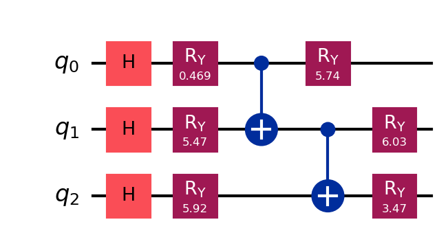
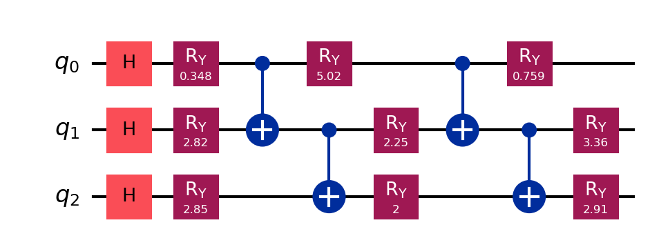

# VQE Simulation of a 3-Qubit Transverse Field Ising Model

Implementation of the Variational Quantum Eigensolver (VQE) algorithm to estimate 
the ground state energy of a three-qubit Transverse Field Ising Model (TFIM), with 
analysis of ansatz expressibility using exact diagonalization as a benchmark.

## Model

The Hamiltonian studied is:

H = J(Z₀Z₁ + Z₁Z₂) + h(X₀ + X₁ + X₂)

where J is the nearest-neighbor coupling strength and h is the transverse magnetic 
field. Simulations were performed with J=1 and h varied from 0 to 2.

## Key Results

| Method | Ground State Energy | Gap from Exact |
|---|---|---|
| Exact Diagonalization | -2.4032 | — |
| Expressive Ansatz (9 params) | -2.3426 | 0.0606 |
| Shallow Ansatz (6 params) | -2.3216 | 0.0816 |

The expressive ansatz closed **25.8%** of the expressibility gap left by the 
shallow circuit. Both circuits plateau well before 300 iterations, confirming 
the remaining gap is a structural limit of the ansatz architecture, not an 
optimization failure.

## Project Structure


## Results

### Energy Convergence


### Ansatz Expressibility Gap


### Energy vs Magnetic Field


## Circuit Diagrams

### Shallow Ansatz (6 parameters)


### Expressive Ansatz (9 parameters)


## Setup

```bash
python -m venv .venv
.venv\Scripts\activate       # Windows
pip install -r requirements.txt
python run_experiment.py
```

## Stack
- Python 3.14
- Qiskit 2.4.2
- qiskit-aer 0.17.2
- NumPy / Matplotlib

## Author
R. Sanju — M.Sc. Physics (Quantum Computing), Bharathiar University  
Thesis project, Dr. N.G.P. Arts and Science College | IISc Bangalore (CHEP internship)