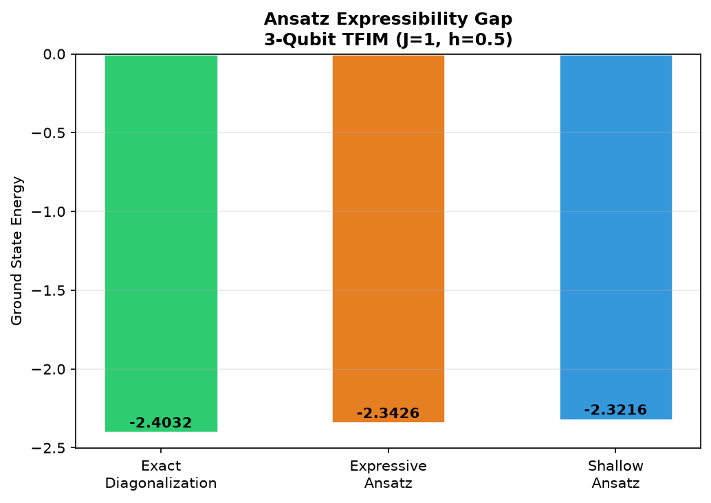
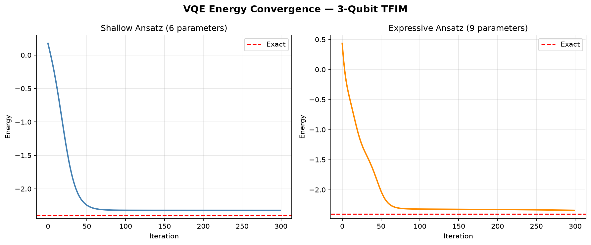
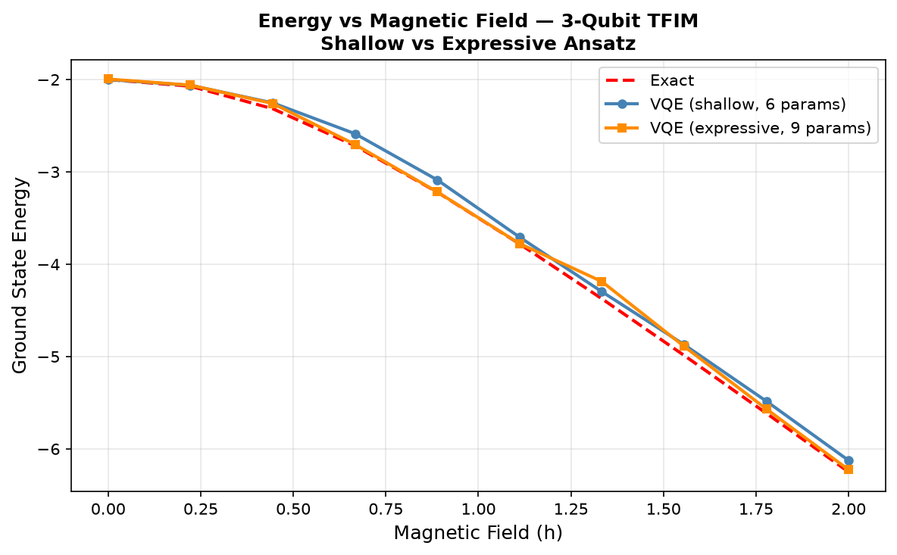
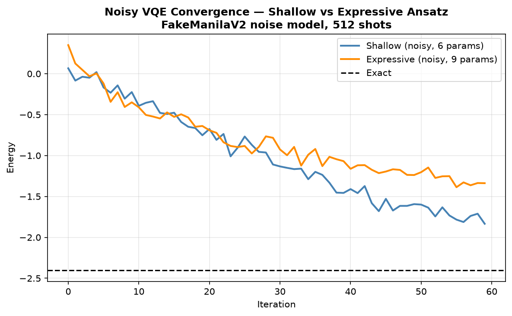

# VQE Simulation of a 3-Qubit Transverse Field Ising Model

Variational Quantum Eigensolver implementation studying the effect of
ansatz expressibility and hardware noise on ground-state energy estimation.

## Overview
- Hamiltonian: H = J(Z1Z2 + Z2Z3) + h(X1+X2+X3), J=1, h=0.5
- Two ansatz circuits compared: shallow (6 params) vs expressive (9 params)
- Noiseless results via exact statevector simulation
- Noisy results via a FakeManilaV2 (real IBM hardware calibration snapshot) noise model

## Key Results

| | Final Energy | Gap vs Exact |
|---|---|---|
| Exact diagonalization | -2.4032 | — |
| Shallow VQE (noiseless) | -2.3216 | 0.082 |
| Expressive VQE (noiseless) | -2.3426 | 0.061 |
| Shallow VQE (noisy) | ~-1.92 | ~0.48 |
| Expressive VQE (noisy) | ~-1.22 | ~1.18 |

**Key finding:** the expressive ansatz outperforms the shallow ansatz in
noiseless simulation, but this reverses under realistic hardware noise —
the deeper circuit's extra entangling layer accumulates more gate error,
making the simpler ansatz more noise-resilient despite being less accurate
in the ideal case.

### Ansatz expressibility gap (noiseless)


### Energy convergence (noiseless)


### Energy vs magnetic field, both ansatzes


### Noisy vs noiseless convergence, shallow vs expressive


## Structure
- `src/vqe_tfim/` — Hamiltonian, ansatz circuits, optimizer, noise model
- `run_experiment.py` — noiseless VQE, convergence plots, field sweep
- `run_noise_experiment.py` — noisy VQE comparison (both ansatzes)

## Setup
```
pip install -r requirements.txt
pip install qiskit-aer qiskit-ibm-runtime   # for noise simulation
```

## Usage
```
python run_experiment.py
python run_noise_experiment.py
```

## Notes
- Noisy results use finite-shot (512 shots) measurement and are
  stochastic — expect small run-to-run variation between runs.
- FakeManilaV2 is a static calibration snapshot, not a live hardware connection.
